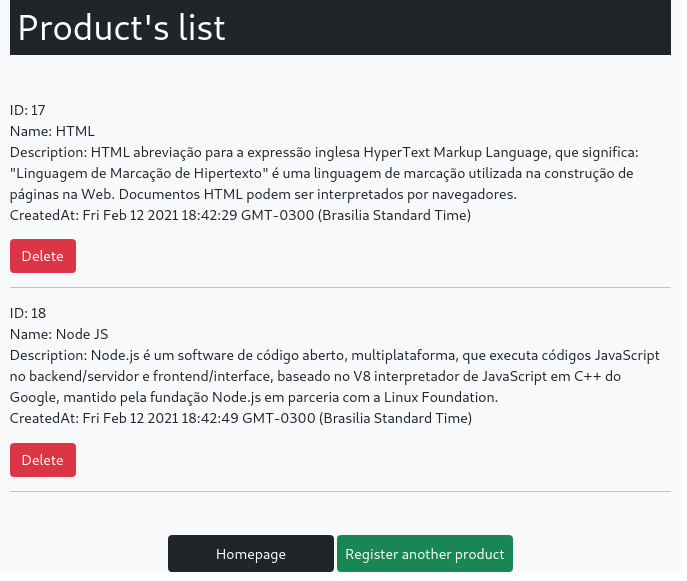

# Projeto de estudos sobre Node - Desenvolvimento de uma API / CRUD

------------
Esse projeto foi desenvolvido com o intuito de aprender novas tecnologias e praticar as mesmas.

Na construção desse projeto foi utilizado o Design Pattern MVC para melhor organização do código e posteriormente uma fácil manutenção do mesmo. 

## Foram utilizadas as seguintes tecnologias no desenvolvimento:

- [] NodeJS
- [] Express
- [] BodyParser
- [] MySQL
- [] Sequelize
- [] Handlebars
- [] Bootstrap

## Funcionalidades adicionadas:

- [x] Adicionar um produto
- [x] Listar todos os produtos
- [x] Remover um produto

*Ainda é necessário adicionar a funcionalidade de ~~editar~~ um determinado produto.*

------------

Antes de baixar o projeto e testar as funcionalidades, verifique se possuí o **mysql-server** instalado no seu computador. 

Caso esteja tudo instalado corretamente siga os passos abaixo:

1. git clone do projeto

2.  entre na pasta raiz do projeto e rode o comando `npm install` 

3. Altere as informações no arquivo **db.js** dentro da pasta database de acordo com as configurações do seu banco de dados.

	Altere as seguintes informações de acordo com as configurações do seu banco de dados mysql:

	**database** - coloque o nome do seu banco de dados
	**user** - coloque o nome de usuário do seu db
	**password** - sua senha de entrada do banco db*

		const sequelize = new Sequelize('database', 'user', 'password', {
			hostname: 'localhost',
			dialect: 'mysql'
		})

4. Dentro da pasta models, no arquivo ProductModel descomente a linha comentada e rode o comando `node ProductModel.js` nesse arquivo pelo menos uma vez para que o model seja criado, após isso comente a linha novamente. 

5. Volte a pasta raiz do projeto e rode o comando `node app.js` e entrar na url: http://localhost:8080

------------

> Author do projeto: ***Wesley Gessner***
